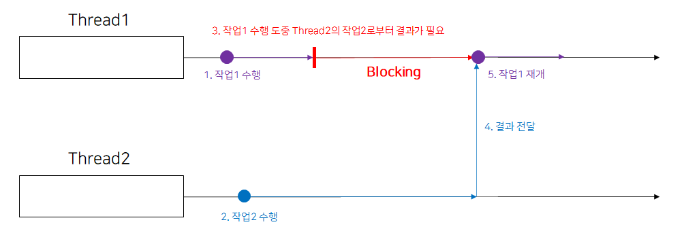
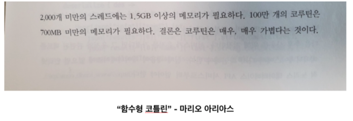
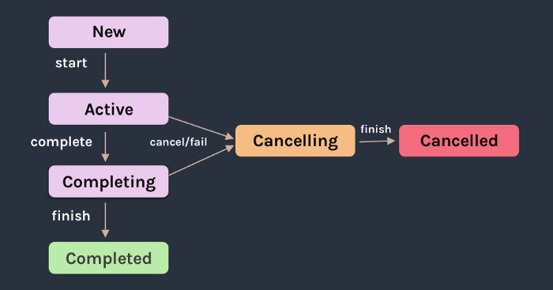
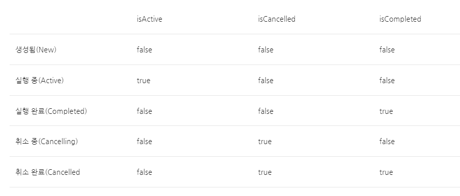

# Coroutine
- Coroutine 은 Co + Routine 으로 Co 는 함께 라는 뜻을 가지고 있고 Routine 은 컴퓨터 프로그램의 일부로서, 특정한 일을 실행하기 위한 일련의 명령이라는 뜻을 가지고 있다. 결국 둘을 합하면 **함께 수행되는 함수** 라는 의미로 해석할 수 있다.

## Coroutine 이 필요한 이유

- Thread 는 프로세스의 자원을 이용해 실제로 작업을 수행하는 것을 의미하는데, 안드로이드에는 Main Thread 와 그 외의 Thread 들이 있습니다.
- Main Thread 가 많은 부하를 받는 작업에 의해 중단된다면, 안드로이드 앱은 멈춤 현상이 생기고, 일정 시간이 지나면 ANR 다이얼로그를 띄우면서 강제로 종료됩니다. 이러한 현상을 방지하기 위해서 Main Thread 가 아닌 다른 Thread 에서 높은 부하를 작업을 수행하도록 만들어야 합니다.
- 하지만 기존의 방식으로는 Thread 1 에서 작업을 하고, Thread 2 에서 작업을 하는 도중, Thread1 에서 Thread2 의 결과가 필요한 경우, Thread 1 은 Thread2 의 작업이 끝날 때 까지 무기한으로 대기를 해야된다는 문제점이 있었습니다.



- 이러한 한계점을 극복하기 위해서 우리는 Coroutine 을 사용합니다.


- 위 그림을 통해 순차적으로 설명한다면
1. Thread 1 에서 두개의 Coroutine 을 생성하여 Thread 1 에서는 작업 1을 Thread 2 에서는 작업 2를 수행하도록 만듭니다.
2. Thread 1 에서 Thread 2 에서 하는 작업 2 의 결과가 필요해지면, Thread 1 의 Coroutine 1 이 중단되고 Thread 1 의 Coroutine 2 가 작업 3을 시작합니다.
3. Thread 2 의 작업이 끝나면 그 결과를 Thread 1 에 반환하며, Thread 1 의 Coroutine 1 이 다시 재개됩니다. 그와 동시에 Thread 1 의 Coroutine 2 가 잠시 정지됩니다.
- 위와 같이 Coroutine 을 이용한다면, 기존에 Thread 2 에서 작업 결과가 필요할 때, Thread 1 이 무기한 대기를 하던 상황을 없앨 수 있어, Thread 의 리소스를 최대한으로 활용할 수 있게 됩니다.
- 또한, Thread 의 생성 비용을 줄여서 작업을 하는 데 필요한 리소스를 절약할 수 있습니다.



## Coroutine 의 특징
- 코루틴의 특징 중 하나인 협력형 멀티태스킹에 대해서는 위에서 설명했으니 이번엔 동시성 프로그래밍에 대해 이야기 해보겠습니다.
- 코루틴은 구조화된 동시성의 개념을 따릅니다.

> **구조화된 동시성**이란? 
> 생성된 모든 Thread 가 명확한 진입점과 종료점을 가지며, 종료전에 완료되었는지 확인하는 제어 흐름 구조를 통해 동시 실행 Thread를 캡슐화하는 것입니다.
-  그러므로, 새로운 코루틴은 오직 구체적인 CoroutineScope 안에서만 실행될 수 있으며, 그것을 통해 코루틴의 수명을 정해줄 수 있습니다.
- 실제 코드에서 구조화된 동시성을 따르는 코루틴을 사용함으로써, 바깥 scope 는 안의 child coroutine 들이 다 끝난 후에 완료되는 것을 보장하며, 그로 인해 손실을 없앨 수 있습니다. 또한 코드에서 에러가 난다면 좀 더 명확하게 찾을 수 있습니다.
- Kotlin 은 Stack Frame  을 사용하여 로컬 변수와 함께 실행 중인 함수를 관리합니다. Coroutine 을 정지하면 현재 Stack Frame 이 복사되고 저장됩니다. 재개되면 스택 프레임이 저장된 위치에서 다시 복사되고 함수가 다시 실행됩니다.
> **Stack Frame** : 메로리의 스택(stack) 영역은 함수의 호출과 관계되는 지역 변수와 매개변수가 저장되는 영역입니다. 스택 영역은 함수의 호출과 함께 할당되며, 함수의 호출이 완료되면 소멸합니다. 함수가 호출되면 스택에는 함수의 매개변수, 호출이 끝난 뒤 돌아갈 반환 주소값, 함수에서 선언된 지역 변수등이 저장됩니다. 이렇게 스택 영역에 차례대로 저장되는 함수의 호출 정보를 스택 프레임(Stack Frame) 이라고 합니다.

## Coroutine 과 Dispatcher
- 그렇다면 우리는 이렇게 편리하고 기능도 많은 코루틴을 안드로이드에서 어떻게 적용시켜서 사용할지 고민하게 됩니다.
- 위에서 잠깐 나왔던 CoroutineScope 에 대해 이야기 하자면, CoroutineScope 를 통해서 각 Coroutine 만의 Scope 를 선언할 수 있습니다. 
- CoroutineScope 는 안의 코드가 모두 완료되기 전까지는 완료되지 않으며, 작업을 하던 도중 잠시 멈춰서 사용하고 있던 쓰레드를 놓아주고 다른 작업을 할 수 있게 만들어줍니다.
- 또한 CoroutineScope 는 안드로이드의 Dispatcher 와도 밀접한 연관이 있습니다. Coroutine 을 사용할 때는 3가지의 Dispatcher 를 주로 사용하는데 이는 안드로이드 시스템 안에 기본으로 생성되어 있습니다.
1. Dispatchers.Main : UI 와 상호작용하고 빠른 작업을 실행하기 위해서 사용. suspend 함수를 호출하고 Android UI 프레임워크 작업을 실행하며, LiveData 객체를 업데이트 (UI 갱신, Toast 등의 View 작업)
2. Dispatchers.IO : 기본 Thread 외부에서 디스크 또는 네트워크 I/O 를 실행하도록 최적화 되어있습니다. (네트워킹이나 내부 DB 접근 등 백그라운드에서 필요한 작업)
3. Dispatchers.Default : CPU 를 많이 사용하는 작업을 기본 Thread 외부에서 실행하도록 최적화되어있습니다. 목록을 정렬하고 JSON 을 파싱하는데 사용합니다.
- Coroutine Scope 는 launch 또는 async 를 사용하여 만든 coroutine 을 추적합니다.
- 특정 수명 주기 클래스에 자체 Coroutine Scope 를 제공합니다.
> Activity, Fragment -> lifecycleScope
> 
> View -> ViewTreeLifecycleOwner + lifecycleScope
> 
> ViewModel -> viewModelScope
> 
> Service -> LifecycleService + lifecycleScope
> 
> Application -> ProcessLifecycleOwner + lifecycleScope

## Launch 와 Async
- Coroutine 을 실행하는데에는 launch 와 async 를 사용할 수 있는데 두 가지에 어떤 차이점이 있는지 알아봅시다.
- launch : 코루틴을 시작하고 호출자에게 결과를 반환하지 않습니다. '실행 후 삭제' 로 간주되는 모든 작업은 launch 를 사용하여 시작할 수 있습니다. lauch 는 job 오브젝트를 반환하며, 이를 이용하여 coroutine 의 작업이 끝날 때 까지 기다리는데에 사용할 수 있습니다.
- async : 코루틴을 시작하고 await 라는 정지 함수로 결과를 반환하도록 허용합니다. 그 결과값은 Deferred 로 감싸서 반환됩니다.

그럼 dispatcher 와 launch, async 를 사용한 간단한 예제를 만들어보겠습니다.


- 기본적으로 작업은 Main Dispatcher  안에서 시작되도록 Dispatcher.Main 으로 설정
- 결과값 반환이 필요한 경우 async 를 사용하여 마지막 줄을 반환 합니다.
- 각각의 경우에 await() 를 사용하여 async 로 부터 결과값 반환을 기다립니다.
- 결과값 반환이 필요 없는 경우에는 launch 를 사용하여 작업을 완료합니다.

## Suspend Fun
- Suspend fun 은 일시중단이 가능한 함수를 말하며, 해당 함수내에 일시 중단이 가능한 작업이 있다는 것을 뜻합니다.
- Suspend fun 은 일반 함수처럼 그냥 사용할 수는 없으며, 반드시 CoroutineScope 내부에서 동작하거나, 다른 Suspend fun 안에서 동작해야 합니다.

## Job
- 위에서 다뤘던 Coroutine 빌더인 launch 를 사용하면, Job 이 생성되고 바로 실행됩니다.
- 하지만 이렇게 하면, Job 이 필요한 위치에 바로 생성해서 실행시켜야 되기 때문에 유연성이 떨어집니다.
- launch 뒤에 CoroutineStart.LAZY 를 넣으면 Job 이 실행되지 않고 대기상태에 들어가게됩니다.
- 이러한 Job 을 실행시키기 위해 start() 와 join() 이 있습니다.
- start() 는 일시중단 없이 Coroutine  Job 을 실행합니다.
- join() 은 Job 이 완료될 때까지 Job 이 실행되고 있는 Coroutine 을 일시중단 시켜줍니다.

## withContext
- withContext() 를 통해서 join 과 await 를 대체할 수 있습니다.
- 기존에 다른 Coroutine 으로 부터 결과값을 가져오려면 deferred 로 감싼 다음 결과값을 await() 로 수신해주었습니다.

```
suspend fun main(){
	val value : Deferred<String> = CoroutineScope(Dispatchers.IO).async{
		"Specific result"
	}
	val result = value.await()
	print(result)
}
```


- 하지만 withContext() 에는 **withContext 블록의 마지막 줄이 반환 값이 됨** 과 **withContext 가 끝나기 전까지 해당 코루틴은 일시정지 됨** 의 두가지 특징을 가지고 있기 때문에 이를 대체할 수 있습니다.

```
suspend fun main(){
	val value : String = withContext(Dispatchers.IO){
		"Specific result"
	}
	print(result)
}
```
- 위와 같이 필요한 코드의 양을 줄이면서 간단하게 작성할 수 있게 됩니다.

이러한 Job 이 항상 완료되지는 않습니다. 그럼 이제부터 Job 을 실패하거나 취소하는 경우에 대해 알아봅시다.

## Coroutine 취소 정책 (Cancellation Policy)
- Coroutine 을 제때 정지시키거나 취소시키는 것은 매우 중요한데, 이는 필요없는 소켓의 연결이나 파일을 읽는 행동을 함으로써 사용자의 리소스가 낭비되는 것을 막아줍니다.
- Coroutine 의 생명주기는 다음과 같습니다.



- Coroutine 은 보통 Active 상태에서 시작됩니다.
- Completing 상태는 Coroutine 의 child job 들이 아직 완료되지 않아서 대기하고 있는 상태를 의미하며, Coroutine 내부적으로는 세개의 플래그가 동작합니다.
1. isActive - Active 와 Completing 상태에서 true 값을 가짐
2. isCompleted - 기본은 false 이며, 모든 parent 와 child job 들이 완료되는 시점에 true 로 바뀜
3. isCancelled - 기본은 false 이며, 코루틴을 취소한 경우에만 true  로 값이 바뀜
- 위 내용을 표로 정리하면 다음과 같습니다.



- Coroutine 을 사용하는 도중 에러가 발생하여 취소할 경우 CoroutineExceptionHandler 를 이용하여 에러를 유형별로 처리하면 됩니다.
- Coroutine 의 취소정책에 의하면 자식 Coroutine 이 하나라도 취소되면 부모 Coroutine 도 취소되어 작업 자체가 중단되게 되는데, 이는 실제 서비스에서 심각한 버그를 야기할 수 있습니다.
- 이러한 현상을 방지하기 위해서 우리는 Job  과 Supervisor Job 의 차이점을 알고 있어야 합니다.
- 부모 Job 이 Job 으로 선언되어 있다면 child Job 들 중에서 하나라도 실패하거나 취소된다면 모든 Job 들이 취소되게 됩니다.
- 부모 Job 이 Supervisor Job 으로 선언되어 있다면, Child Job 들 중에 특정 Job 만 골라서 실패하거나 취소 시킬 수 있게 됩니다.

그렇다면 우리는 Coroutine 을 사용할 때 Dispatcher 를 지정해주고 ExceptionHandler 를 지정해주는 부분을 Coroutine 을 하나 만들때 마다 각각 지정해주어야 할까요? 그 문제를 해결하기 위해 Coroutine Context 를 이용할 수 있습니다.

## Coroutine Context
- CoroutineScope 를 보면 매개변수로 Coroutine Context 를 요구하는 것을 볼 수 있습니다. 
- Dispatcher 나 CoroutineExceptionHandler 모두 CoroutineContext 를 확장하는 인터페이스의 구현체이기 때문에 CoroutineScope 의 매개변수로 들어갈 수 있습니다.
- CoroutineContext 는 Coroutine 이 실행되는 환경이라고 생각하면 됩니다.
- CoroutineContext 에 이미 구현되어 있는 함수인 public operator fun plus 를 사용하여 Dispatcher 와 CoroutineExceptionHandler 를 결합해 하나의 Context 로 만들 수 있습니다.
```
suspend fun main(){
	val exceptionHandler = CoroutineExceptionHandler {coroutineContext, throwable -> }

	val coroutineContext = Dispatchers.Default + exceptionHandler
	
	CoroutineScope(coroutineContext).launch{
	
	}
}

```

## References 참고문헌
https://developer.android.com/kotlin/coroutines?hl=ko
https://kotlinlang.org/docs/coroutines-basics.html
https://betterprogramming.pub/kotlin-coroutines-from-basics-to-advanced-ad3eb1421006
https://kotlinworld.com/155?category=973476
