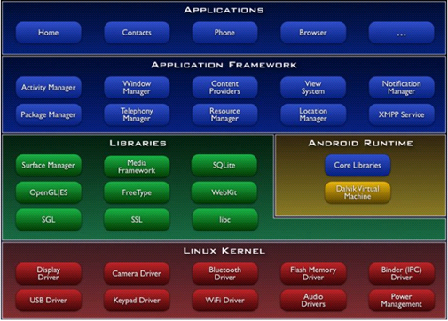
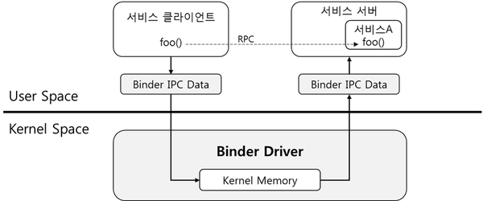
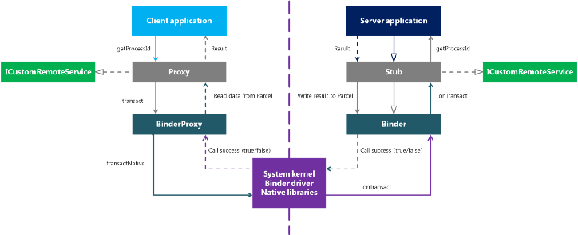

# 공식 Developers의 서비스 소개

```서비스는 사용자와 상호작용하지 않으면서 오랜 시간이 걸리는 작업을 수행하거나 다른 애플리케이션에서 사용할 기능을 제공하기 위한 목적을 나타내는 애플리케이션 컴포넌트다.```

## 서비스의 종류
 - 백그라운드 서비스(Background Service)
   - 앱이 백그라운드 상태에 있을때도 어떠한 동작이 되어야할때 사용한다.
 - 포그라운드 서비스(Foreground Service)
   - 사용자에게 현재 작업중인 내용을 Notification으로 보여주어야하며, 대개 백그라운드 서비스가 리소스 부족으로 우선순위에서 밀려나 종료되는걸 방지하기위해 사용된다.
 - 바인드 서비스(Bind Service)
   - 서비스 컴포넌트에서 통신을 위한 인터페이스를 제공해야하며, 바인딩을 허용하지 않으려면 `onBind()`에서 null을 반환하면 된다. 혹은 다른 어플리케이션의 액세스를 차단하려면 매니페시트에서 `android:exported="false"` 옵션을 주면 된다.
   - 바인드 서비스는 위 두가지 서비스와 다르게 `context.bindService()`, `context.unbindService()`함수로 시작/종료를 호출하며, 동적으로 액티비티와 상호작용을 위해 사용될 수 있다. 이때는 액티비티에서 `ServiceConnection` 인터페이스를 구현한 리스너를 `bindService()`의 파라미터로 보내야하며, 리스너의 콜백 함수는 `onServiceConnected()`, `onServiceDisconnected()` 두 콜백 함수에 따라 액티비티에서 Service 객체를 할당 및 정리를 해주어야한다.
   - 밑의 예제 코드는 바인드 서비스를 액티비티에서 연결해 서비스의 함수를 동적으로 사용해 0~10 까지 로그를 띄우는 함수다.
```
class TestService : LifecycleService() {

    override fun onBind(intent: Intent): IBinder {
        super.onBind(intent)
        return LocalBinder()
    }

    fun count(): Flow<Int> = flow {
        (0..10).forEach { emit(it) }
    }

    inner class LocalBinder : Binder() {
        val service: TestService get() = this@TestService
    }
}

class MainActivity : BaseActivity<ActivityMainBinding>() {

    private var testServiceBinder: TestService.LocalBinder? = null
    private val serviceConnection = object : ServiceConnection {
        override fun onServiceConnected(name: ComponentName?, service: IBinder?) {
            testServiceBinder = service as TestService.LocalBinder
        }

        override fun onServiceDisconnected(name: ComponentName?) {
            testServiceBinder = null
        }
    }

    override fun onCreate() {
        binding.btn.setOnClickListener {
            testServiceBinder?.service?.count()?.onEach {
                Log.d("123123", "count: $it")
            }?.launchIn(lifecycleScope)
        }
    }

    override fun onStart() {
        super.onStart()
        val intent = Intent(this, TestService::class.java)
        bindService(intent, serviceConnection, BIND_AUTO_CREATE)
    }

    override fun onStop() {
        super.onStop()
        unbindService(serviceConnection)
    }
}
```

위 예제에서는 `LifecycleService` 를 사용했는데, 이는 jetpack에서 제공하는 Service를 상속받은 컴포넌트로 해당 컴포넌트에서 코루틴을 간편하게 사용하도록 lifecycleScope를 제공하며, 내부 구조는 심플하다. 간단히 설명하자면..

`LifecycleService`는 `Service`를 상속받으면서, `LifecycleOwner` 인터페이스 구현체이다. 해당 컴포넌트는 `ServiceLifecycleDispatcher` 라는 객체를 전역변수로 가지며 해당 객체 생성자 파라미터에 `LifecycleOwner`를 넘기며, `ServiceLifecycleDispatcher` 안에서 내부적으로 서비스의 생명주기에 맞게 동작한다.

위 코드에서 조금만 수정해보자.
현재 서비스에서 flow 스트림을 제공하는 함수를 액티비티의 `lifecycleScope`에서 작동하는데 `LifecycleService`의 사용의 `lifecycleScope`를 사용해서 변경할 것이다.

```
class TestService : LifecycleService() {

    ...

    fun count() {
        flow {
            (0..10).forEach { emit(it) }
        }.onEach {
            Log.d("123123", "count: $it")
        }.launchIn(lifecycleScope)
    }
}

class MainActivity : BaseActivity<ActivityMainBinding>() {

    ...

    override fun onCreate() {
        binding.btn.setOnClickListener {
            testServiceBinder?.service?.count()
        }
    }
}
```

위 코드는 이제 액티비티의 생명주기에 의존하지 않는다.

`LifecycleOwner.LifecycleScope가 액티비티에서 서비스로 변경 되었기 때문에 이제부터 해당 flow는 서비스의 생명주기를 따른다.`

`LifecycleService`를 사용하려면 아래의 의존성을 추가해야한다.

> gradle "androidx.lifecycle:lifecycle-service:$lifecycle_version"

# 서비스의 생명주기

> 책(전문가를 위한 안드로이드 프로그래밍)의 내용중 ... 
>
> 서비스는 액티비티의 생명주기와 조금 다르다.
>
> 우선 서비스의 생명주기는 사용자와 상호작용에 의해 직접적인 영향을 받지 않는다.
>
> 라고 명시되어있다.

```액티비티의 경우 홈버튼을 눌렀을때 항상 onPause()가 호출된다. 반면 서비스는 사용자 행동에 의해 이와 같이 직접적으로 호출되는 콜백이 없다.```

서비스가 항상 호출되는 콜백함수는 onCreate(), onDestroy() 두 가지뿐이다.(서비스와의 상호작용 및 시스템, 화면 회전 같은 기기 상태 변경에 따라 다른 콜백이 호출될 수도 있다.)

간단히 말해 서비스는 액티비티보다 생명주기를 관리하기가 훨씬 쉽다.

```서비스는 onCreate()에서 객체생성 onDestroy()에서 정리 작업을 수행해야 한다는 사실만 기억하면 된다.```

기본적으로 서비스를 실행할때. `context.startService()` 혹은 `context.startForegroundService()` 를 호출 할 경우 서비스는

- onCreate()
- onStartCommand()
- onDestroy()

순으로 실행되며, 바인드 서비스의 경우(`context.bindService()`)
- onCreate()
- onBind()
- onUnbind()
- onDestroy()

순으로 실행된다.

이때 만약 사용자가 앱을 강제종료해서 task를 날린다면, 바인드 서비스의 경우 `onDestroy()`가 호출되지만, 포그라운드/백그라운드 서비스는 호출되지 않는다.
이를 해결하기 위해서는 서비스의 매니페스트 옵션에 `android:stopWithTask="false"` 를 추가해서 해결할 수 있다.

# onStartCommand()

서비스의 onStartCommand() 함수는 항상 Int 형의 상수를 반환해야하며 아래와 같은 타입들이 있다.

- START_STICKY
  - 시스템에서 어떤 이유(주로 메모리 이슈)로 서비스를 재시작하려고 함을 시스템에 알린다. 하지만 시스템에서 서비스를 재시작하면 `Intent`파라미터가 null인 상태로 `onStartCommand()`가 호출 되므로 코드에서 이 부분을 각별히 주의해야한다. 이 반환값을 주로 사용하는 예로는 항상 같은 방식으로 서비스를 시작하는 음악 플레이어 등이 있다. 이 말은 `onDestroy()`가 호출될 때 서비스의 내부 상태를 저장해야 함을 뜻한다.
- START_NOT_STICKY
  - 시스템에서 해당 서비스를 종료 후 재시작 하지 않는다. 이 반환값은 서버 업로드처럼 한 번만 작업을 수행하기 위해 서비스로 `Intent`를 보내는 경우에 적합하다. 작업을 완료하기 전에 서비스가 종료되면 작업을 반복하지 않는다.
- START_REDELIVER_INTENT
  - START_STICKY 와 비슷하게 동작하지만 서비스가 재시작될때 원본 `Intent`(서비스를 시작했을때의 `Intent`)를 항상 다시 전달한다.

# 바인드 서비스

위에서 짧게 소개했지만, 실제론 공식 Developers에서도 바인드 서비스를 위한 카테고리가 있을 정도로 꽤나 내용이 길다.

`startService()`, `startForegroundService()`로 실행된 서비스에 `bind/unbind`로 해당 서비스에 바인딩 처리가 가능하다.
이러한 방식으로 서비스를 사용할 경우 `unbind` 시에도 서비스가 소멸되지 않으니, 서비스의 종료 시점을 확실히 가져야한다.(`stopSelf()`, `stopService()`)

## Binder?, IPC?, RPC?, AIDL?

먼저 IPC와 RPC에 대해 알아야하며, 리눅스의 IPC(Inter Process Communication) 기술에 RPC(Remote Procedure Call) 메커니즘이 적용된 바인더 프레임워크이다.

이는 사진에 나와있듯이 리눅스 커널 위에서 라이브러리 레벨에서 돌아간다.



`클라이언트 프로세스 -> 커널의 공유 메모리(바인더 프레임워크) -> 서버 프로세스` 순서로 실행되며, 
프로세스와 커널이 통신(RPC)하는 과정을 `트랜잭션`이라 부른다.



> Android의 모든 컴포넌트는 서버 프로세스 형태로 제공되기 때문에 프로세스 사이에 최적화된 통신 방법이 필요하고 그 고민 결과가 바인더 이다. 바인더는 모든 프로세스가 공유하는 커널 메모리를 참조하게 함으로써 메모리 복사 오버헤드를 최소화한다. 뿐만 아니라 C++을 이용해 작성된 RPC(Remote Procedure Call) 프레임워크를 제공하여 생산성이 높다. 라고 "네이버 D2 기술 블로그"에 명시되어있다.

보았듯이 바인더를 사용하면 클라이언트 프로세스(현재 앱)에서 서버 프로세스(시스템 서비스)의 원격 메서드를 간편하게 호출할 수 있다.

## AIDL(Android Interface Definition Language)

안드로이드는 바인더를 간편하게 생성하기 위해 인터페이스 정의 언어인 `AIDL`를 제공해주는데, 이 언어로 인터페이스를 작성하면 자동으로 바인더를 생성해준다.

> `AIDL`은 `Java Programing` 형식으로 작성해야하며, 바인더 또한 자바 코드로 생성된다.

클라이언트 프로세스에서 `AIDL`를 작성하면 `inner class`로 `Stub`, `Proxy` 가 생성된다.

- Proxy : 클라이언트에서 실행되는 코드로 호출하려는 함수를 직렬화(마샬링)하여 요청한다.
- Stub : 서버에서 실행되는 코드로 제공하는 함수를 역직렬화(언마샬링)하여 호출한다.

이제 바인더 순서에 `AIDL`까지 더해서 밑에 사진을 참고할것.



# 참조문헌 References

- [네이버 D2 개발 블로그](https://d2.naver.com/helloworld/47656)
- [전문가를 위한 안드로이드 프로그래밍](http://www.yes24.com/Product/Goods/13433805)
- [KIMSS Blog](https://kimss1502.github.io/android/about_ipc_rpc_binder)